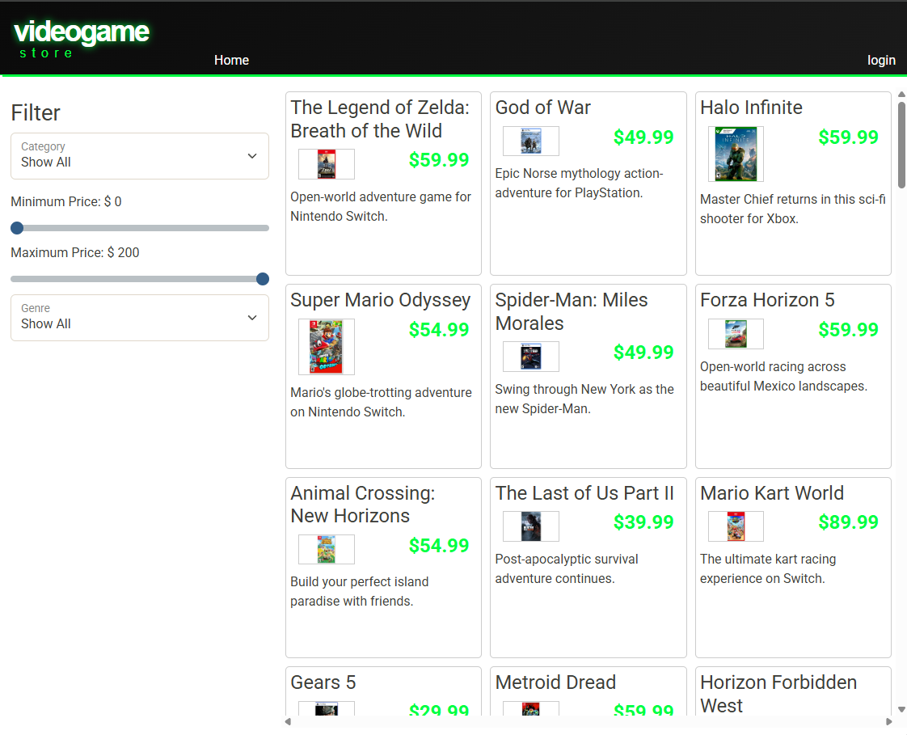
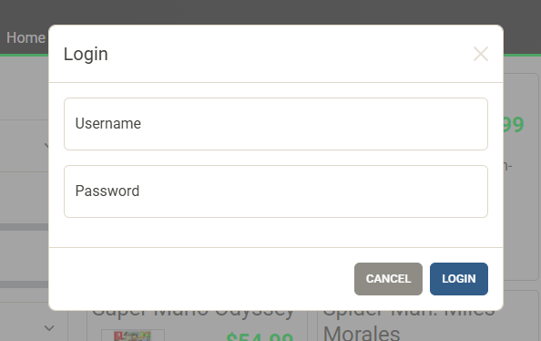
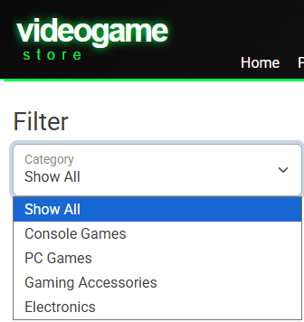

# 
Video Game Store API

---

## Project Overview
The Video Game Store API is a full-stack ready Spring Boot REST API for managing products, categories, shopping carts, and user authentication for an online store.  
It connects to a MySQL database using JDBC and follows modern RESTful design principles.

---

## Key Features

### Authentication
- Secure user login using JWT tokens
- Password hashing with BCrypt
- Role-based authorization (`ROLE_USER`, `ROLE_ADMIN`)
- Token-based authentication for API access

### Shopping Cart
- Each user has a unique cart
- Add, update, or remove products
- Automatically updates item quantity if added again
- Clear the entire cart

### Database
- MySQL-backed persistent data layer
- DAO pattern with Spring-managed Beans
- Clean separation of concerns using `MySqlDaoBase` inheritance

---

## Storefront

#### Here you can:
- View all products or filter by category, price, or subcategory
- CRUD operations for `Products` and `Categories`
- Supports image URLs, stock tracking, and featured items

### Screenshots
___

### Home page:

### Login Screen:

### Minimum Slider:

### Maximum Slider:

### Filtering by Category:

### Adding to Cart:

### Cart Screen

---

## 
Interesting Code

